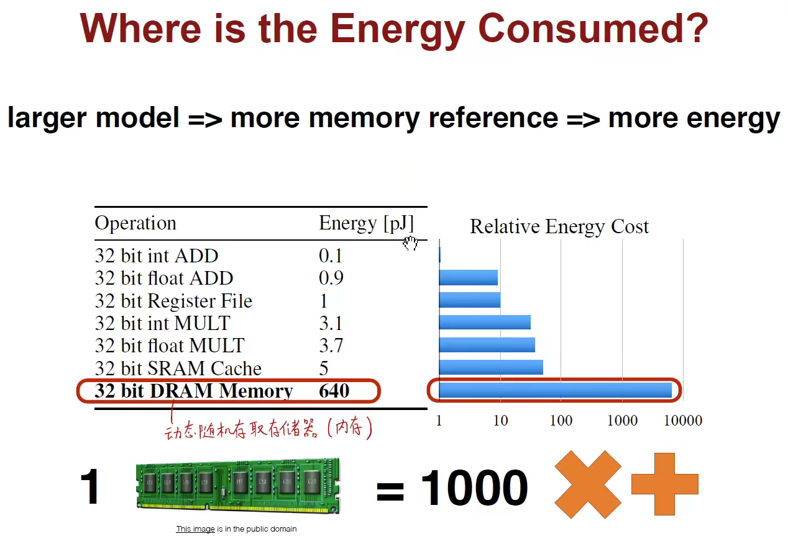

# CS231n: Convolution Neural Network for Visual Recognition

[**Slides for CS231N**](http://cs231n.stanford.edu/slides/)

## Lecture 1: Introduction and Overview

- 视觉信息是暗物质，难以利用
- Evolution's Big Bang 寒武纪大爆发，眼睛和视觉
- Camera Obscura 小孔成像
- 仿生学，猫的视觉感知，人的视觉感知 1959年
- 1963年，边缘检测
- 1966年，MIT暑假视觉项目
- David Marr，视觉分层，提出计算机视觉理论，计算机视觉最高奖项 (ICCV)
- PASCAL Visual Object Challenge
- ImageNet and Challenge (ILSVRC)
- BIg Data and Computation and Algorithms

## Lecture 2: Image Classification Pipeline

- Image Classification: A core task in Computer Vision
- The Problem: Semantic Gap
- Challenge: Viewpoint variation, Background Clutter, Illumination, Deformation, Occlusion, Intraclass variation
- No obvious way to hard-code the algorithm for recognizing a cat, or other classes
- Machine Learning: Data-Driven Approach
    1. Collect a dataset of images and labels
    2. Use Machine Learning to train a classifier
    3. Evaluate the classifier on new images
- First classifier: Nearest Neighbor and K-Nearest Neighbors with majority vote
- Example Dataset: CIFAR10 and CIFAR100
- Distance Metric to compare images: L1 norm and L2 norm (Euclidean distance)
- http://vision.stanford.edu/teaching/cs231n-demos/knn/
- Hyperparameter to choice with train set and validation set and test set

- Distance metrics on pixels are not informative

- Curse of dimensionality (维度陷阱)

- Linear Classifier and Parametric Approach 
- Interpreting with Visual or Geometric or Algebraic viewpoint 
- Hard cases for linear classifier
- How fast are training and prediction?

## Lecture 3: Loss Functions and Optimization

- SVM or Hinge loss with score and regularization (Prefer Simpler Models)
- Softmax Classifier with probability and Multinomial Logistic Regression
- log-probabilities or logits and probabilities and normalized
- Maximum Likelihood Estimating with log Cross entropy or KL divergence
- Random Search for optimization
- Follow the slope for optimization and negative gradient
- Gradient Descent with learning rate (step)
- Numeric Gradient Solution: approximate, slow, and easy solution
- Analytic gradient Solution: exact, fast, and error-prone
- Stochastic Gradient Descent (SGD) or Minibatch Gradient Descent
- Original Pixel and Extract Features in images

## Lecture 4: Neural Networks and Backpropagation

- Impulses carried toward cell body and Biological Neurons
- Neural Networks and Architectures
- Fully-connected networks or Multi-Layer Perceptrons (MLP)
- Activation functions: ReLU, Sigmoid, tanh, Leaky ReLU, Maxout, ELU, PReLU
- Computational Graphs and Backpropagation
- Patterns in gradient flow and chain rule and upstream gradient and local gradient and downstream gradient
- Forward pass to Compute output and Backward pass to Compute grads
- Backprop with Vectors and Jacobian Matrix
- https://cs.stanford.edu/people/karpathy/convnetjs/demo/classify2d.html

## Lecture 5: Convolutional Neural Networks

- Mark I Perceptron machine and update rule
- 1974年，Paul werbos 发明 BP 算法
- 1986年，Rumelhart 重新发明 BP 算法
- 认知科学和神经科学的指导意义
- Hierarchical organization
- https://www.cs.ryerson.ca/~aharley/vis/conv/
- Image Classification, Retrieval, Detection, Segmentation, Self-driving
- Convolutional Neural Networks
- https://github.com/vdumoulin/conv_arithmetic
- https://ezyang.github.io/convolution-visualizer/
- Convolution layer and pooling layer(平移不变性)
- Receptive field and Weight shared and Translation invariance
- 2013年 ZF-Net Paper <\<Visualizing and Understanding Convolutional Networks\>>
- Zero padding to the border of image matrix
- Point-wise convolution and why
- https://cs.stanford.edu/people/karpathy/convnetjs/demo/cifar10.html
- https://transcranial.github.io/keras-js

## Lecture 6: Understanding and Visualizing Convolutional Neural Networks

- Computer Vision Tasks: Classification, Classification + Localization, Object Detection, Instance Segmentation
- CBAPD: Convolution + BatchNorm + Activation + Pooling + Dropout
- Visualize patches that maximally activate neurons
- Visualize the weights
- Visualize the representation space (e.g. with t-SNE)
- Occlusion experiments
- Human experiment comparisons
- Deconv approaches (single backward pass)
- Optimization over image approaches (optimization)
- http://projector.tensorflow.org/
- https://cs.stanford.edu/people/karpathy/cnnembed/
- https://yosinski.com/deepvis
- Forward pass; Backward pass backpropagation; Backward pass "deconvnet"; Backward pass guided backpropagation

## Lecture 7: Training Neural Networks Part I

- 深度学习基础四大件：数据 + 算力 + 算法 + 编程框架
- Activation Functions and Pros and Cons
- Data Preprocessing and Feature Engineering
- Weight Initialization and Importance and "Xavier" initialization and "Kaiming" initialization
- Batch Normalization and Layer Norm and Instance Norm and Group Norm
- Babysiting the Learning Porcess
- Hyperparameter Optimization
- TLDR: Too Long Didn't Read (一言以蔽之)

## Lecture 8: Training Neural Networks Part II

- Optimizers: SGD; SGD + Momentum; Nesterov Momentum; AdaGrad; RMSProp; Adam and warm-up in start
- Learning rate schedules and Decay; Early Stopping 
- First-Order Optimization and Second-Order Optimization (牛顿法)
- Beyond Training Error; Model Ensembles (模型集成, 兼听则明)
- Tips and Tricks (checkpoint ensemble)
- Regularization: Add term to loss (L1 and L2); Dropout and Inverted Dropout and DropConnect; Data Augmentation
- Choosing Hyperparameters
    - 1. Check initial loss
    - 2. Overfit a small sample
    - 3. Find Learning Rate that makes loss go down
    - 4. Coarse grid, train for ~1-5 epochs
    - 5. Refine grid, train longer
    - 6. Look at loss curves
    - 7. GOTO step 5
- Hyperparameters: Random Search; Grid Search

## Lecture 9: CNNs in Practice

- Receptive Field and Separable Convolution Kernel
- The power of small filters
- "bottleneck" 1x1 convolutions
- Implementing Convolutions: im2col
- Implementing Convolutions: FFT (echartsjs.com)
- Implementing Convolutions: "Fast Algorithm"
- Naive matrix multiplication and Strassen's Algorithm

## Lecture 10: CNN Architectures

- Transfer Learning
- Small Dataset or Big Dataset; Different Data Similar Data 
- Fine-training

- AlexNet (2012); ZFNet (2013); VGGNet (2014); GoogLeNet (2014); ResNet (2015); SENet (2017)
- https://keras.io/api/applications/
- Parameters and Memory
- Inception module
- SqueezeNet (2017)
- Network in Network (NiN 2014)
- Identity Mappings in Deep Residual Networks (2016)
- Wide Residual Networks (2016)
- ResNetXt (2016); FractalNet (2017); DenseNet (2017); 
- MobileNets (V1 2017 and V2 2018) Google
- ShuffleNet
- Meta-learning
- Neural Architecture Search with Reinforcement Learning (NAS) (2016)

## Lecture 11: Hardware and Software

- Deep Learning Hardware: CPU, GPU, TPU, FPGA
- Deep Learning Software: PyTorch and TensorFlow; Static and Dynamic Computation Graphs
- NVIDIA CUDA and Optimized APIs: cuBLAS, cuFFT, cuDNN
- https://developer.nvidia.com/udacity-cs344-intro-parallel-programming
- OpenCL
- CPU and GPU Data Communication bottleneck
- Synchronous and Async
- Data parallelism and Model parallelism
- GPU memory bottleneck
- https://storage.googleapis.com/nexttpu/index.html
- OpenVINO Intel; TensorRT NVIDIA

- Caffe/Caffe2
- Torch/PyTorch/PyTorch 1.x
- Theano/TensorFlow/TensorFlow2
- Keras
- MXNet
- PaddlePaddle/Chainer
- CNTK
- JAX
- The point of Deep Learning Frameworks
    1. Quick to develop and test new ideas
    2. Automatically compute gradients (wrap Computational Graphs)
    3. Run it all efficiently on GPU (wrap cuDNN, cuDLAS)
- PyTorch Fundamental Concepts: Tensor, Autograd, Module
- Tensorflow 1.x (Static Graphs) and Tensorflow 2.x (Dynamic Graphs)
- tf.keras and TF-Slim
- TensorBoard for Tensorflow TensorBoardX for PyTorch
- Recurrent networks (循环神经网络) and Recursive networks (递归神经网络) only with Dynamic Graphs
- Modular Networks
- ONNX Support (MicroSoft)

## Lecture 12: Recurrent Neural Networks

- Recurrent Neural Networks: Process Sequences
- one to one; one to many; many to one; many to many;
- Sequential Processing of Non-Sequence Data
- Three Weight Shared with Time Dimension
- Encoder and Deconder Conceptions
- One-hot code and Vocabulary
- Backpropagation through time
- Searching for interpretable cells
- Image Captioning with Attention
- Visual Question Answering: RNNs with Attention
- Vanilla RNN Gradient Flow
- Long Short Term Memory (LSTM 1997) and GRU
- Transformer (2018 "Attention is all you need") and Vision Transformer (ViT)

## Lecture 13: Efficient Methods and Hardware for Deep Learning

- Song Han CS231 Spring 2017
- https://songhan.mit.edu/
- Models are getting larger
- The first Challenge: Model Size
- The second Challenge: Training Speed
- The third Challenge: Energy Efficiency
- Improve the Efficiency of Deep Learning by Algorithm-Hardware Co-Design
- Hardware: General Purpose (CPU and GPU) and Specialized HW (ASIC and FPGA and TPU)
- Number Representation in Computer

- Algorithms for Efficient Inference
    1. Pruning
    2. Weight Sharing
    3. Quantization
    4. Low Rank Approximation
    5. Binary / Ternary Net
    6. Winograd Transformation
- Hardware for Efficient Inference
    1. A common goal: minimize memory access
    2. Eyeriss MIT RS Dataflow
    3. DaDiannao CAS eDRAM
    4. TPU Google
    5. EIE Stanford Compression/Sparsity
- Efficient Training with Algorithms
    1. Parallelization (Data and Model)
    2. Mixed Precision with FP16 and FP32
    3. Model Distillation
    4. DSD: Dense-Sparse-Dense Training
- Efficient Training with Hardware
    1. GPU for training
    2. GPU Architectures
    3. TPU for training
- Future: Smart; Low Latency; Privacy; Mobility; Energy-Efficient