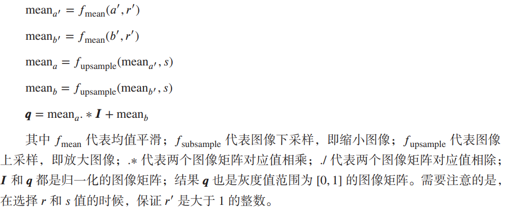
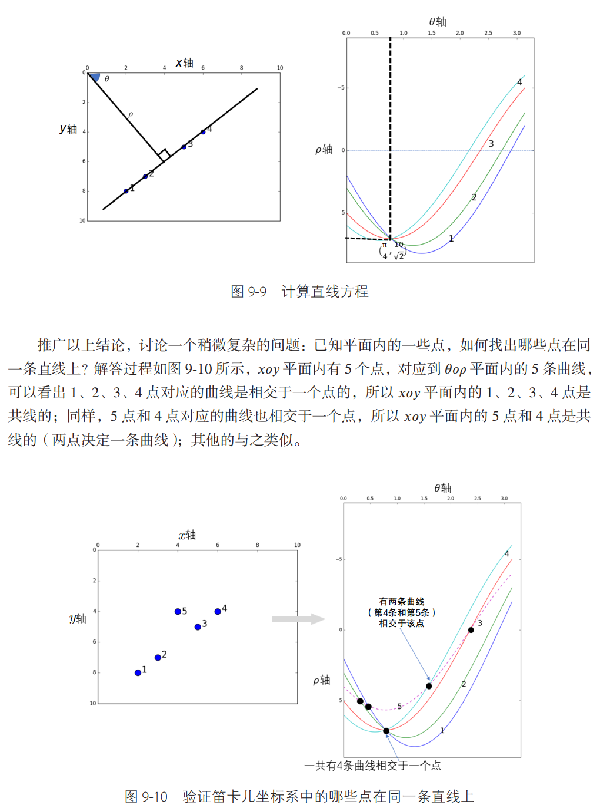
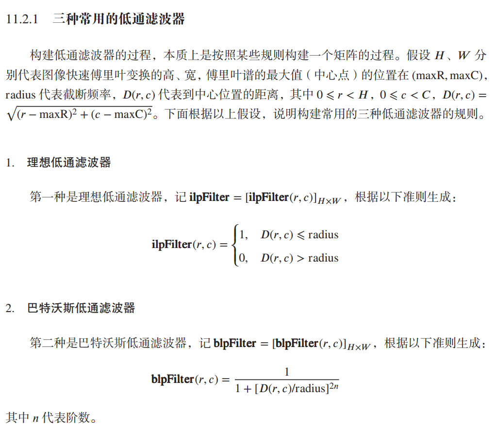
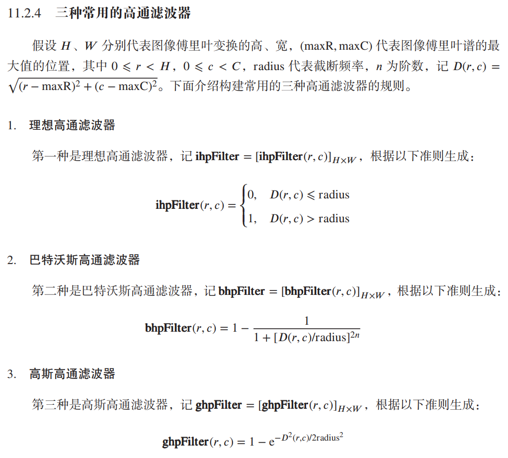
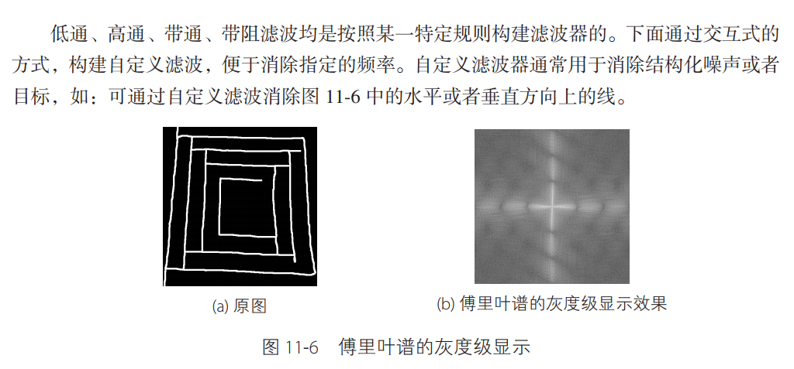

# 数字图像处理

**参考书籍《OpenCV算法精解—基于Python与C++》**

## 数字图像的几何变换

对图像进行放大、缩小、旋转等操作，这类操作改变了原图中各区域的空间关系，通常称为图像的几何变换。

完成图像的几何变换需要两个独立的算法：算法实现空间坐标变换，如何从初始位置移动到终止位置;插值算法完成输出图像的每个像素的灰度值。

三种几何变换：仿射变换、投影变换和极坐标变换。


### 计算仿射变换矩阵

```Python
#!/usr/bin/env python3
# encoding: utf-8

"""
@Funciton: 已知原始坐标和变换后的坐标，计算仿射变换矩阵
@Python Version: 3.8
@Author: Wei Li
@Date: 2021-09-12
"""

import numpy as np
import cv2 as cv


def compute_affine_transform_matrix(src, dst):
    """利用 OpenCV 的 Python API 计算仿射变换矩阵。

    Args:
        src (float): 3 行 2 列的二维 ndarray，每一行代表一个原始坐标
        dst (float): 3 行 2 列的二维 ndarray，每一行代表一个变换后的坐标

    Returns:
        float: 返回仿射变换矩阵(3行3列)的前两行(2行3列)，
            最后一行为[0, 0, 1](齐次坐标表示法)
    """
    return cv.getAffineTransform(src=src, dst=dst)


def compute_affine_transform(scale, translation):
    """数字图像首先经过缩放变换，在进行平移变换。
    利用基本的仿射变换进行矩阵乘法求解出仿射变换矩阵。

    Args:
        scale (np.array): 基本的仿射变换——缩放
        translation (ndarray): 基本的仿射变换——平移
    
    Returns:
        float: 返回仿射变换矩阵(3行3列)
    """
    # 注意计算方向
    # return np.dot(scale, translation)
    return np.dot(translation, scale)


def compute_affine_transform_ratio(center, angle, scale):
    """等比例进行缩放并进行旋转。
    计算仿射变换矩阵，其本质还是计算各个基本的仿射矩阵进行相乘计算。

    Args:
        center ([type]): 变换中心的坐标
        angle ([type]): 等比例缩放的系数
        scale ([type]): 逆时针旋转的角度，单位为角度，而不是弧度；该值为负数，即为顺时针旋转。

    Returns:
        [type]: 通过旋转，平移，缩放等基本操作后的仿射变换矩阵(齐次坐标表示的前两行数值)
    """

    return cv.getRotationMatrix2D(center=center, angle=angle, scale=scale)


# --------------------------
if __name__ == "__main__":
    # 1. 方程方法
    src = np.array([[0, 0], [200, 0], [0, 200]], np.float32)
    dst = np.array([[0, 0], [100, 0], [0, 100]], np.float32)
    affine_transform_matrix = compute_affine_transform_matrix(src=src, dst=dst)
    print(f"The affine transform maxtrix type is\n {type(affine_transform_matrix)}")
    print(f"The affine transform maxtrix data type is\n {affine_transform_matrix.dtype}")
    print(f"The affine transform maxtrix is\n {affine_transform_matrix}")

    # 2. 矩阵方法
    scale = np.array([[0.5, 0, 0], [0, 0.5, 0], [0, 0, 1]])
    translation = np.array([[1, 0, 100], [0, 1, 200], [0, 0, 1]])
    affine_transform = compute_affine_transform(scale=scale, translation=translation)
    print(f"The affine transform maxtrix type is\n {type(affine_transform)}")
    print(f"The affine transform maxtrix data type is\n {affine_transform.dtype}")
    print(f"The affine transform maxtrix is\n {affine_transform}")

    # 3. 计算 (40, 50)为中心点进行逆时针旋转30度的仿射变换矩阵
    rotataion_matrix = compute_affine_transform_ratio(center=(40, 50), angle=30, scale=0.5)
    print(f"The affine transform maxtrix type is\n {type(rotataion_matrix)}")
    print(f"The affine transform maxtrix data type is\n {rotataion_matrix.dtype}")
    print(f"The affine transform maxtrix is\n {rotataion_matrix}")
```

```C++
/**
 * @File    : compute_affine_transform_matrix.cpp
 * @Brief   : 已知原始坐标和变换后的坐标，计算仿射变换矩阵
 * @Author  : Wei Li
 * @Date    : 2021-09-12
*/

#include <iostream>
#include <opencv2/core.hpp>
#include <opencv2/imgproc.hpp>

// C++ API of OpenCV 输出参数有两种方式
// 1. 原始坐标和对应的变换后的坐标以 Point2f 进行存储
// 2. 原始坐标和对应的变换后的坐标以 Mat 进行存储
// -------------------------------------------
// 3. 利用 Linux OS 对 OpenCV 源代码进行编译和链接，同时利用 CMake 进行构建
// 编译和链接参考：https://gitee.com/weili_yzzcq/C-and-C-plus-plus/tree/master/OpenCV_Linux_Ubuntu
// 编译和链接参考：https://github.com/2694048168/C-and-C-plus-plus/tree/master/OpenCV_Linux_Ubuntu
// -------------------------------------------
// 
// **传入参数**
// - 指针作为函数参数
// - 通常有 const 关键字修饰
// - 指针指向有效区域，在函数内部做读操作

// **传出参数**
// - 指针作为函数参数
// - 在函数调用之前，指针指向的空间可以无意义，但必须有效
// - 在函数内部，做写操作
// - 函数调用结束后，充当函数返回值

// **传入传出参数**
// - 指针作为函数参数
// - 在函数调用之前，指针指向的空间有效而且有实际意义
// - 在函数内部，先做读操作，后做写操作
// - 函数调用结束后，充当函数返回值
// -------------------------------------------
int main(int argc, char** argv)
{
    // 1. 第一种方式
    cv::Point2f src[] = {cv::Point2f(0, 0), cv::Point2f(200, 0), cv::Point2f(0, 200)};
    cv::Point2f dst[] = {cv::Point2f(0, 0), cv::Point2f(100, 0), cv::Point2f(0, 100)};
    cv::Mat affine_transform_matrix = cv::getAffineTransform(src, dst);
    std::cout << affine_transform_matrix << std::endl;

    // 2. 第二种方式
    cv::Mat src_mat = (cv::Mat_<float>(3, 2) << 0, 0, 200, 0, 0, 200);
    cv::Mat dst_mat = (cv::Mat_<float>(3, 2) << 0, 0, 100, 0, 0, 100);
    cv::Mat affine_transform_mat = cv::getAffineTransform(src_mat, dst_mat);
    std::cout << affine_transform_mat << std::endl;

    // 通过基本的仿射变换进行矩阵乘法求解仿射变换矩阵
    // 缩放矩阵
    cv::Mat scale = (cv::Mat_<float>(3, 3) << 0.5, 0, 0, 0, 0.5, 0, 0, 0, 1);
    // 平移矩阵
    cv::Mat translation = (cv::Mat_<float>(3, 3) << 1, 0, 100, 0, 1, 200, 0, 0, 1);
    cv::Mat affine_transform;
    // 注意计算方向(先缩放后平移), 仿射矩阵计算和需要操作的过程相反！！！
    // cv::gemm(scale, translation, 1.0, cv::Mat(), 0, affine_transform, 0);
    cv::gemm(translation, scale, 1.0, cv::Mat(), 0, affine_transform, 0);
    std::cout << affine_transform << std::endl;

    // 等比例进行缩放 平移 旋转操作
    // center 变换中心的坐标；angle : 等比例缩放的系数  scale : 逆时针旋转的角度，单位为角度，而不是弧度；该值为负数，即为顺时针旋转。
    cv::Mat rotataion_matrix = cv::getRotationMatrix2D(cv::Point2f(40, 50), 30, 0.5);
    std::cout << rotataion_matrix << std::endl;
    
    return 0;
}
```


```bash
# @Funciton: 已知仿射变换矩阵，利用插值方法完成图像的几何变换(空间域操作)
# @File: interpolation_algorithm.cpp and interpolation_algorithm.py
```

### 计算投影变换矩阵

```bash
# @Funciton: 已知原始坐标和变换后的坐标，通过方程方法计算投影矩阵，利用 投影矩阵完成投影变换
# @File: compute_perspective_matrix.cpp and compute_perspective_matrix.py

# @File: compute_perspective_mouse.cpp
# @Brief: 利用 OpenCV 提供的鼠标事件，在原图和输出的画布上选择4组对应的坐标，计算投影变换矩阵并完成投影变换。
```

投影变换和仿射变换都是两个笛卡尔坐标之间的额变换，图像的极坐标变换涉及到笛卡尔平面坐标和极坐标之间空间变换关系。

### 极坐标变换


```bash
# @Funciton: 笛卡尔坐标和极坐标之间转换
# @File: compute_polar.cpp and compute_polar.py
```


```bash
# @Funciton: 利用极坐标变换对图像进行变换，校正图像中的圆形区域 OpenCV 实现了线性极坐标变换和对数极坐标变换。
# @File: polar_transform_img.cpp and polar_transform_img.py
```

## 图像对比度增强

对比度增强或者称为对比度拉伸就是图像增强技术的一种，它主要解决由于图像的灰度级范围较小造成的对比度较低的问题，目的就是将输出图像的灰度级放大到指定的程度，使得图像中的细节看起来更加清晰。

对比度增强有几种常用的方法，如线性变换、分段线性变换、伽马变换、直方图正规化、直方图均衡化、局部自适应直方图均衡化等，这些方法的计算代价较小，但是却产生了较为理想的效果。

灰度直方图是一种计算代价非常小但却很有用的工具，它概括了一幅图像的灰度级信息。灰度直方图是图像灰度级的函数，用来描述每个灰度级在图像矩阵中的像素个数或者占有率，用占有率（或称归一化直方图、概率直方图）。

### 灰度直方图

```bash
# @Funciton: 计算灰度直方图(归一化直方图，概率直方图)
# @File: calc_gray_hist.cpp and calc_gray_hist.py
```

### 灰度线性变换拉伸增强对比度


```bash
# @Funciton: 线性变换进行对比度增强
# @File: gray_transform.cpp and gray_transform.py
```


```bash
# @Funciton: 线性变换进行对比度增强; 直方图正规化；
# @File: gray_transform.cpp and gray_transform.py
```

### 伽马变换

图像的伽马变换实质上是对图像矩阵中的每一个值进行幂运算。


```bash
# @Funciton: 图像的伽马变换，可以实现全局或者局部的对比度增强，亮度增大，人眼观察的视觉更多
# @File: gamma_transform.cpp and gamma_transform.py
```

### 全局直方图均衡化

直方图均衡化后的结果易受噪声、阴影和光照变化的影响，噪声对所得图像的影响非常大。


```bash
# @Funciton: 灰度图像的直方图均衡化(全局直方图均衡化)
# @File: hist_equalization.cpp and hist_equalization.py
```

### 限制对比度的自适应直方图均衡化

直方图均衡化原理，使用方法很简单，只支持对8位图的处理。
虽然全局直方图均衡化方法对提高对比度很有效，但是均衡化处理以后暗区域的噪声可能会被放大，变得清晰可见，而亮区域可能会损失信息。
为了解决该问题，提出了自适应直方图均衡化(Aptive Histogram Equalization)方法。


```bash
# @Funciton: 灰度图像的直方图均衡化(全局直方图均衡化)
# @File: hist_equalization.cpp and hist_equalization.py
```

## 图像平滑(图像滤波)

图像都包含某种程度的噪声,噪声可以理解为由一种或者多种原因造成的灰度值的随机变化，如由光子通量的随机性造成的噪声等，在大多数情况下，通过平滑技术（滤波技术)进行抑制或者去除，其中具备保持边缘（Edge Preserving)作用的平滑技术得到了更多的关注。常用的平滑处理算法包括基于二维离散卷积的高斯平滑、均值平滑，基于统计学方法的中值平滑，具备保持边缘作用的平滑算法的双边滤波、导向滤波等。

### 二维离散卷积

- full convolution
- valid convolution
- same convolution
- Separable convolution 可分离卷积
- Properties of Discrete Convolution 离散卷积的性质

```bash
# @Funciton: 二维离散卷积(full，valid，same)；可分离卷积核以及其性质
# @File: discrete_convolution.cpp and discrete_convolution.py
```

### 高斯平滑滤波


```bash
# @Funciton: 计算高斯卷积算子；高斯卷积核的可分离；高斯卷积核进行图像平滑(模糊)
# @File: gauss_kernel.cpp and gauss_kernel.py
```

### 均值平滑滤波


```bash
# @Funciton: 图像积分; 快速均值滤波(平滑)
# @File: integral_mean.cpp and integral_mean.py
```

### 中值平滑滤波


```bash
# @Funciton: 椒盐噪声; 中值滤波(平滑)-非线性滤波器
# @File: midden_salt.cpp and midden_salt.py
```

### 双边滤波


```bash
# @Funciton: 双边滤波; 非常耗时，提出双边滤波的快速算法
# @File: bilateral_filter.cpp and bilateral_filter.py
```

### 联合双边滤波


```bash
# @Funciton: 联合双边滤波
# @File: joint_bilateral_filter.cpp and joint_bilateral_filter.py
```


### 导向滤波


```bash
# @Funciton: 引导滤波(导向滤波); 利用几何变换加速导向滤波(快速引导滤波)
# @File: guide_filter.cpp and guide_filter.py
```




## 阈值分割

当人观察景物时，在视觉系统中对景物进行分割的过程是必不可少的，这个过程非常有效，以至于人所看到的并不是复杂的景象，而是一些物体的集合体。该过程使用数字图像处理描述，就是把图像分成若干个特定的、具有独特性质的区域，每一个区域代表一个像素的集合，每一个集合有代表着一个物体，而完成该过程的技术通常称为图像分割，它是从图像处理到图像分析的关键步骤。

图像分割方法主要分为：基于阈值的分割方法、基于区域的分割方法、基于边缘的分割方法，以及基于特定理论的分割方法

### 全局阈值分割


```bash
# @Funciton: 全局阈值分割
# @File: global_threshold.cpp and global_threshold.py
```

### 局部阈值分割


### 直方图技术确定阈值


```bash
# @Funciton: 局部阈值分割; 直方图技术；
# @File: local_threshold_hist.cpp and local_threshold_hist.py
```

### 信息熵技术确定阈值


```bash
# @Funciton: 局部阈值分割; 信息熵技术;
# @File: local_threshold_entropy.py
```

### Otsu 算法确定阈值


```bash
# @Funciton: 局部阈值分割; Otsu算法;
# @File: local_threshold_otsu.py and local_threshold_otsu.cpp
```

### 自适应阈值


```bash
# @Funciton: 局部阈值分割; 自适应阈值分割;
# @File: adaptive_threshold.py and adaptive_threshold.cpp
```

### 二值图的逻辑运算

```bash
# @Funciton: 二值图的逻辑运算
# @File: image_bit.py and image_bit.cpp
```

## 形态学处理

### 腐蚀和膨胀操作


```bash
# @Funciton: 形态学操作：腐蚀(选择一个任意领域[结构元]里面的最小值)和膨胀(选择一个任意领域[结构元]里面的最大值)
# @File: erode_dilate_image.cpp and erode_dilate_image.py
```

### 开运算和闭运算

腐蚀操作和膨胀操作的组合


### 顶帽变换、底帽变换、形态学梯度

顶帽(Top-hat)变换和底帽(Bottom-hat)变换是分别以开运算和闭运算为基础的


```bash
# @Funciton: 形态学操作：开运算(腐蚀后膨胀)和闭运算(膨胀后腐蚀); 顶帽变换、底帽变换、形态学梯度
# @File: open_close_morphology.cpp and open_close_morphology.py
```

## 边缘检测


### Roberts 算子


```bash
# @Funciton: 基于方向差分卷积核进行卷积操作——Roberts Operator(Algorithm)
# @File: roberts_algorithm.cpp and roberts_algorithm.py
```

Roberts 边缘检测因为使用了很少的邻域像素来近似边缘强度，因此对图像中的噪声具有高度敏感性。利用图像平滑的去除噪声的方法，先对图像进行平滑处理，然后再进行 Roberts 边缘检测

### Prewitt 边缘检测


**从 Roberts 和 Prewitt 边缘检测的效果图可以清晰地理解差分方向（或称梯度方向)与得到的边缘方向是垂直的，如水平差分方向上的卷积反映的是垂直方向上的边缘。**

```bash
# @Funciton: Prewitt Operator(Algorithm) —— 可分离卷积核
#         Prewitt算子均是可分离的，为了减少耗时，
#        在代码实现中, 利用卷积运算的结合律先进行水平方向上的平滑，再进行垂直方向上的差分，
#        或者先进行垂直方向上的平滑，再进行水平方向上的差分
# @File: prewitt_operator.cpp and prewitt_operator.py
```

### Sobel 边缘检测


```bash
# @Funciton: Sobel 算子进行边缘检测 —— 可分离卷积核
# @File: sobel_operator.cpp and sobel_operator.py
```

### Scharr 算子

Scharr 边缘检测，由于 Scharr 卷积核中系数的增大，所以对灰度变化较为敏感，即使灰度变化较小的区域，也会得到
较强的边缘强度，因此得到的边缘显得丰富，但是不够细化。


```bash
# @Funciton: Scharr 边缘检测算子 —— 不可分离卷积核
# @File: scharr_operator.cpp and scharr_operator.py
```

### Kirsch 算子和 Robinson 算子

边缘检测算子均是由两个方向上的卷积核组成的，也有由各个方向上的卷积核组成的边缘检测算子。


```bash
# @Funciton: Kirsch and Robinson 边缘检测算子 —— 四面八方的进行差分(梯度信息，边缘强度)
# @File: robinson_operator.py and kirsch_operator.py
```

### Canny 边缘检测


```bash
# @Funciton: Canny 边缘检测算子 - 解决边缘梯度方向的信息问题和阈值处理问题
# @File: canny_operator.py and canny_operator.cpp
```

### Laplacian 算子


```bash
# @Funciton: 拉普拉斯二维微分算子 —— 不可分离的单独一个卷积
#        拉普拉斯算子对噪声很敏感，使用首先应对图像进行高斯平滑，然后再与拉普拉斯算子卷积，最后得到二值化边缘图。
#        水墨效果的边缘图，该边缘图也在某种程度上体现了边缘强度。
# @File: laplace_operator.py and laplace_operator.cpp
```

### 高斯拉普拉斯(LoG)边缘检测


```bash
# @Funciton: 高斯拉普拉斯算子 —— 先二维高斯平滑处理，后进行拉普拉斯微分算子  —— 可分离高斯拉普拉斯卷积核
#         拉普拉斯算子对噪声很敏感，使用首先应对图像进行高斯平滑，然后再与拉普拉斯算子卷积，最后得到二值化边缘图。
# @File: laplace_gaussian_operator.py and laplace_gaussian_operator.cpp
```

### 高斯差分(DoG)边缘检测

**虽然高斯拉普拉斯核可分离，但是当核的尺寸较大时，计算量仍然很大，通过高斯差分近似高斯拉普拉斯，从而进一步减少计算量。**


```bash
# @Funciton: 高斯差分边缘检测(接近高斯拉普拉斯算子) —— 计算量减少
# @File: laplace_diff_gaussian.py and laplace_diff_gaussian.cpp
```

### Marr-Hildreth 边缘检测


**真正用代码实现寻找过零点的方式有很多，比较常用的和有效的是如下两种方式。第一种方式: 针对图像矩阵与高斯差分核(或者高斯拉普拉斯核）的卷积结果，对每一个位置判断以该位置为中心的 3×3 邻域内的上/下方向、左/右方向、左上/右下方向、右上/左下方向的值是否有异号出现。**


```bash
# @Funciton: Marr-Hildreth 边缘检测 基于 高斯差分算子核高斯拉普拉斯算子
# @File: marr_hildreth.py and marr_hildreth.cpp
```

## 几何形状的检测和拟合

**通过阈值分割提取图像中的目标物体**

**通过边缘检测提取目标物体的轮廓**

**使用这两种方法基本能够确定物体的边缘或者前景, 通常需要做的是拟合这些边缘和前景，如确定边缘是否满足某种几何形状，如直线、圆、椭圆等，或者拟合出包含前景或者边缘像素点的最小外包矩形、圆、凸包等几何形状，为计算它们的面积或者模板匹配等操作。**

### 点集的最小外包


```bash
# @Funciton: 点集的最小外包：圆形、直立矩阵、旋转矩阵、三角形、凸多边形
# @File: pointSet_minOutsourcing.py and pointSet_minOutsourcing.cpp
```

**点集的概念，通过阈值分割或者边缘检测得到的二值图，这些二值图中的前景像素点(目标或者边缘)就可以被看成笛卡儿坐标系中的点集。讨论这些前景像素点，如何利用霍夫变换检测哪些前景像素点在一条直线上。**

### 霍夫直线检测




**结论: 判断 xoy 平面内哪些点是共线的，首先求出每一个点对应到霍夫空间的曲线，然后判断哪几条曲线相交于一点，最后将相交于一点的曲线反过来对应到 xoy 平面内的点，这些点就是共线的，这就是在图像中进行标准霍夫直线检测的核心思想。**

```bash
# @Funciton: 霍夫变换 (Hough Transform) 进行二值图像的直线检测
# @File: hough_transform.py and hough_transform.cpp
```

** 标准的霍夫直线检测内存消耗比较大，执行时间比较长，基于这一点，提出了概率霍夫直线检测，它随机地从边缘二值图中选择前景像素点，确定检测直线的两个参数，其本质上还是标准的霍夫直线检测。一般在直线检测中使用后者**

### 霍夫圆检测和基于梯度的霍夫圆检测


```bash
# @Funciton: 霍夫圆检测；基于梯度的霍夫圆检测
#    尽管标准的霍夫变换对于曲线检测是一项强有力的技术，但是随着曲线参数数目的增加，造成计数器的数据结构越来越复杂，如直线检测的计数器是二维的，圆检测的计数器是三维的，这需要大量的存储空间和巨大的计算量，因此通常采用其他方法进行改进，如同概率直线检测对标准霍夫直线检测的改进,那么基于梯度的霍夫圆检测就是对标准霍夫圆检测的改进
# @File: hough_circle.py
```

### 轮廓

**查找、绘制轮廓**
**外包、拟合轮廓**
**轮廓的周长和面积**
**点和轮廓的位置关系**
**轮廓的凸包缺陷**

```bash
# @Funciton: 轮廓：
#        查找、绘制轮廓
#        外包、拟合轮廓
#        轮廓的周长和面积
#        点和轮廓的位置关系
#        轮廓的凸包缺陷
# @File: contour.cpp and contour.py
```

## 傅里叶变换

### 二维离散的傅里叶变换

**傅里叶变换是线性系统分析的工具，能够定量分析数字化系统，把傅里叶变换的理论同其物理解释相结合，将有助于解决大多数图像处理问题。**


### 傅里叶幅度谱和相位谱


```bash
# @Funciton: 二维离散傅里叶变换; 快速傅里叶变换; 幅度谱(零谱中心化)和相位谱
# @File: fourier_transform.cpp and fourier_transform.py
```

### 谱残差显著性检测

**生物视觉研究表明，视觉注意机制是一种具有选择性的注意，它首先由视觉内容中最显著的、与其周围其他内容相比差异更大的成分引起(梯度/差分)，然后根据观察者的主观意识去选择注意(深度学习中的注意力机制)。视觉显著性检测可以看作抽取信息中最具差异的部分或者最感兴趣或首先关注的部分，赋予对图像分析的选择性能力，对提高图像的处理效率是极为重要的。显著性检测的方法有很多，一种简单、高效的基于幅度谱残差的方法.**


```bash
# @Funciton: 显著性检测: 谱残差显著性检测
# @File: spectral_residual_significance.cpp and spectral_residual_significance.py
```

### 卷积与傅里叶变换的关系(卷积定理)


```bash
# @Funciton: 卷积定理: 卷积定义和傅里叶变换的关系
# @Funciton: 卷积定理: 卷积定义和傅里叶变换的关系(利用快速傅里叶变换)
#@     对于卷积核为任意尺寸或者锚点在任意位置的情况，只是最后的裁剪部分不同。
#@    虽然通过定义计算卷积比较耗时，但是当卷积核较小时，通过快速傅里叶变换计算卷积并没有明显的优势;
#@    只有当卷积核较大时，利用傅里叶变换的快速算法计算卷积才会表现出明显的优势。
# @File: conv_fft_theorem.py and conv_fft_theorem.cpp
```

### 利用快速傅里叶变换计算卷积(卷积定理)


## 频率域滤波


### 频率域滤波原理


### 低通滤波和高通滤波

**图像的傅里叶变换，低频信息表示图像中灰度值缓慢受化的区域; 而高频信息则相反，表示灰度值变化迅速的部分，如边缘。**

**低通滤波，保留傅里叶变换的低频信息; 或者削弱傅里叶变换的高频信息**

**高通滤波则相反，保留傅里叶变换里面高频信息，移除或者削弱傅里叶变换的低频信息**





**高通滤波器和低通滤波器满足这样的天系: hpFilter = 1 - lpFilter, 对于图像的高通滤波，只需要将低通滤波的实现中的第五步替换成高通滤波器就可以了**

```bash
# @Funciton: 低通滤波器和高通滤波器(理想滤波器；巴特沃斯滤波器；高斯滤波器)
# @File: low_high_filter.cpp and low_high_filter.py
```

### 带通和带阻滤波器


### 自定义滤波器

**如果消弱水平方向上的频率，则会去除图像中垂直方向上的线**
**如果消弱垂直方向上的频率，则会去除图像中水平方向上的线**



```bash
# @Funciton: 自定义频域滤波器，消除指定结构或者目标
# @File: custom_filter.cpp
```

### 同态滤波


```bash
# @Funciton: 同态滤波
# @File: homomorphic_filter.py
```

## 色彩空间

### 常见色彩空间

**RGB, HSV, HLS, Lab, YUV**

- 灰度图像的每一个像素都是由一个数字量化的(单通道)，而彩色图像的每一个像素都是由三个数字量化的(多通道)

- RGB 色彩空间源于使用阴极射线管(CRT )的彩色电视。RGB模型使用加性色彩混合以获知需要发出什么样的光来产生给定的色彩。具体色彩的值用三个数值的向量来表示，这三个数值分别代表三种基色:Red 、Green、Blue的亮度。假设每种基色的数值量化成 $m = 2^n$ 个数，如同 8 位灰度图像一样，将灰度量化成$2^8 = 256$ 个数。RGB 图像的红、绿、蓝三个通道的图像都是一幅 8 位图，因此颜色的总数为 $256^3= 16777216$，如(0,0,0)代表黑色，(255,255,255)代表白色。

- HSV —— 色调(Hue)、饱和度(Saturation)、亮度值(Value)，又称 HSB —— 色调(Hue )、饱和度(Saturation)、亮度(Brightness ), HSV将亮度信息从彩色中分解出来，而色调和饱和度与人类感知是相对应的，因而使得该模型在开发图像算法中非常有用。如果将对比度增强算法用在 RGB 的每个分量上，那么人类对该图像的色彩感知就变得不够理想了;而如果仅对HSV的亮度分量进行增强，让彩色信息不受影响，那么效果就会或多或少地与期望相近。

- HLS 色彩空间(Lightness/Liminance), HLS色彩空间也称作HSI —— Hue(色调)、Saturation(饱和度)、Intensity(亮度)。亮度是用来描述明亮程度的，通过百分比的方式来表示，以[0,1]范围进行量化。通过亮度的大小来衡量有多少光线从物体表面反射出来，是帮助眼睛去感知色彩的重要属性。显然，当一个具有色彩的物体处于较暗或者较亮的地方时，眼睛通常无法正确地分辨出物体表面原本的色彩。饱和度是用来描述纯色彩所添加的白光的程度的，即色彩的纯度。饱和度通过百分比的方式来表示，以[0,1]范围来量化。饱和度的数值越高，则表示色彩的纯度越高;反之，色彩的纯度越低，比如红色，会有深红、浅红之分。

- Lab、YUV 色彩空间，与 RGB 色彩空间可以相互转换，在 OpenCV 的官方文档中有完整的转换公式，色彩空间的转换都封装在函数cvtColor中。

### 调整彩色图像的饱和度和亮度

```bash
# @Funciton: 色彩空间的转换; 调整彩色图像的饱和度和亮度
# @File: convert_color.cpp and convert_color.py
```
