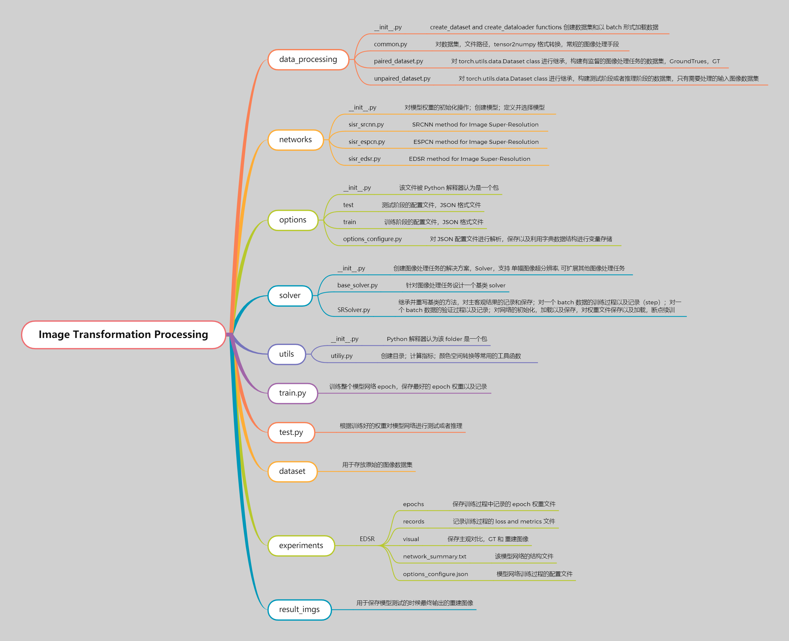

## Image Transformation Processing with PyTorch

> Welcome everybody to fork, star and watch this repository and project.

### Quick Start

> [关于Python环境的详细配置过程以及技巧](https://2694048168.github.io/blog/#/PaperMD/python_env_ai)

```shell
# create 'pytorch' env. with python 3.11.2
conda create --name pytorch python=3.11.2

# pip install all library
pip install -r requirements.txt
```



Image transformation processing using Deep Learning technology with PyTorch platform, including the **image super-resolution** (SR), image deraining, image defogging or image dehaze, low-illumination image enhancement, infrared and visible image fusion, multi-exposure image fusion, remote sensing image fusion(Pansharpening). Image transformation processing tasks, which the input of network is a image and the output of network is also a image. The framework can be well extended to high-level computer vision processing tasks such as image classification, object detection, instance segmentation.

### Configuration for Training and Inference phase

#### Train Phase Configuration

```json
{
    // "mode" 指定图像处理任务的类型, 实现了 Single Image Super-Resolution,
    // 可以进行扩展, 在 ./networks/__init__.py 文件中 create_model 进行注册即可
    "mode": "SISR",

    // 指定使用显卡列表, 支持多显卡进行数据并行训练, [0, 1, 2, 3,] 显卡编号列表
    "gpu_ids": [0],

    // 设置随机种子, 保证结果的可重复性
    "manual_seed": 42,

    // for Image Super-Resolution scale, 指定图像超分倍数
    "scale": 4,

    // 指定是训练还是测试阶段 false is the inference phase
    "is_train": true,

    // 指定是否需要 enable the memory-efficient test
    "use_chop": true,

    // 图像的像素等级, 一般都是 8bit 进行数字图像量化
    "rgb_range": 255,

    // whether use Geometric Self-ensemble for Image Super-Resolution, EDSR/EDSR+
    "self_ensemble": false,

    // 是否需要在训练阶段保存主观对比图, GroundTrues and Reconstructed Images.
    "save_image": false,

    // 针对数据集的一些配置信息
    "datasets": {
      // phase is train
        "train": {
          // 数据集的类型 mode, "PAIRED" or "UNPAIRED", 配对的有监督的图像数据集, 以及测试阶段测试真实图像数据集
          "mode": "PAIRED",

            // Labels or GroundTrues 监督的图像文件夹路径
            // 建议 原始数据集 不要放在该项目路径下, 因为由于图像数据集一般很大,
            // 使用 PyCharm 进行第一次加载该项目的时候, PyCharm 扫描所需要的时间很长,
            // 所以建议 训练的原始数据集放在该项目的外面的文件夹, 建议使用 固态硬盘, 读取速度快, 加速训练
            "GroundTrues": "D:/ImageProcessingTeam/SuperResolutionAlgorithms/DIV2K_train_dataset/HR/raw_npy",
            // 模型输入图像文件夹路径
            "InputImages": "D:/ImageProcessingTeam/SuperResolutionAlgorithms/DIV2K_train_dataset/LR/x4_raw_npy",
            // 图像文件夹中图像存储的格式, 
            // "img" 表示以各种图片格式形式存储的, 
            // "npy" 表示以 numpy.npy 格式形式存储的;
            // 第一次训练如果设置为 "npy", 而 图像数据是以图片格式存储的, 会自动执行生成 npy 格式存储的文件,
            // 源代码在 ./data_processing/common.py 中 get_image_paths function 的逻辑判断中.
            "data_type": "npy",

            // DataLoader 进行数据加载的时候线程数量, 有效加速数据集的读取, 
            // Windows OS 可能存在一些问题, 当 GPU 利用率不低的情况下, 建议设置为 0;
            // Linux OS 建议设置高一些, 使得 GPU 利用率达到 95% 以上.
            "num_workers": 0,

            // DotaLoader 进行数据加载的以 多大的 batch 进行一次训练 step,
            // 建议根据显存的大小和模型规模进行调整, 使得 GPU 显存占用率尽可能的高
            "batch_size": 16,

            // 模型输入图像的大小 Height=Width=48
            "input_img_size": 48,

            // 是否是输入的训练数据集进行一定概率的进行翻转和旋转
            "use_flip": true,
            "use_rot": true,

            // 是否对输入的图像进行 加性噪声 的添加,
            // "G": Gaussian distribution noise;
            // "S": Poisson distribution noise;
            // ".": 表示不添加任何噪声;
            // 还可以自定义噪声类型, 在 ./data_processing/common.py 中 add_noise function.
            "noise": "."
        },
        // phase is validation
        "val": {
          "mode": "PAIRED",
            // 测试数据集一般图像文件都不多, 也不大, 可以考虑放在项目的 dataset 路径下
            // 这样使用 相对路径 ,在拷贝项目文件到不同的设备上, 不需要修改该路径
            "GroundTrues": "./dataset/HR/Set5/x4",
            "InputImages": "./dataset/LR/LRBI/Set5/x4",
            "data_type": "img"
        }
    },

    // 针对网络模型的一些配置信息
    "networks": {
      // 选择模型网络, 需要在 ./networks/__init__.py 文件中进行注册
        "which_model": "EDSR",

        // 下面都是关于模型网络的 构造函数 __init__() 所需要的参数列表
        // 这些参数列表都是根据模型的网络进行配置, 方便很快配置同一个模型的不同版本
        // e.g. for ViT: ViT-Base; ViT-Large; ViT-Huge
        "num_features": 32,
        "in_channels": 3,
        "out_channels": 3,
        "num_blocks": 3,
        "res_scale": 0.1
    },

    // 针对网络模型的解决方案的一些配置信息
    "solver": {
        // 模型的优化器类型, 只实现了 ADAM 优化器,
        // 可以扩展各种优化器, ./solver/SRSolver.py 中进行扩展, 
        // # 选择优化器 optimizer_type = self.train_opt["optim_type"].upper()
        "optim_type": "ADAM",
        // 针对模型权重的正则化, 优化器中的权重衰减系数进行设置 
        "weight_decay": 0,

        // 模型进行训练阶段的初始学习率, e.g. 1e-4
        "learning_rate": 0.0001,
        // 学习率的调整策略, 只实现了 MultiStepLR 策略, 每个一定的 epoch 进行一定权重的进行学习率衰减
        // 可以进行扩展该策略, 实现 余弦退火衰减等学习率策略, ./solver/SRSolver.py 中进行扩展, 
        // # ------------Learning rate scheduler for training Model ----------------------
        // if self.train_opt["learning_rate_scheme"].lower() == "multisteplr":
        // self.scheduler = torch.optim.lr_scheduler.MultiStepLR(self.optimizer,
        // elif self.train_opt["learning_rate_scheme"].lower() == "cosineanealinglr":
        // self.scheduler = torch.optim.lr_scheduler.CosineAnnealingLR()
        "learning_rate_scheme": "MultiStepLR",
        // "learning_rate_scheme": "CosineAnnealingLR",

        // learning rate 在经过多少个 epoch 后会发生变化
        "learning_rate_steps": [2, 4, 6, 8],
        // learning rate 每次变化, 衰减的权重 gamma
        "learning_rate_gamma": 0.5,
        // 对数据集进行多少个 epoch 训练
        "num_epochs": 10,

        // loss function type : L1 or L2
        // 可以进行扩展, 自定义损失函数, ./solver/SRSolver.py 中进行扩展,
        // # set loss function L1 norm or L2 norm
        // loss_type = self.train_opt["loss_type"]
        // if loss_type == "L1":
        "loss_type": "L1",

        // skipping batch that war large error for stable training
        "skip_threshold": 3,

        // split the batch into smaller chunks for less GPU memory consumption during training
        // 当 GPU 显存不足的时候, 可以调整该数值, 减少训练阶段对显存的需求
        "split_batch": 1,

        // 每隔多少个 epoch 来保存权重文件 checkpoint during training
        "save_ckp_step": 50,

        // 每隔多少个 epoch 来保存主管对比图, 需要 save_image is true
        "save_vis_step": 1, 

        // pre-train mode: null (from scratch) 
        // "resume" (resume from specific checkpoint), 断点续训
        // "finetune" (finetune a new model based on a specific model), 微调模型
        "pretrain": null,

        // path to *.pth required by "resume"/"finetune" or in inference phase
        "pretrained_path": "./experiments/EDSR_in3f32_x4/epochs/last_ckp.pth"
    }
}
```

#### Inference Phase Configuration

```json
{
    "mode": "SISR",
    "gpu_ids": [0],
    "manual_seed": 42,
    // just for image super-resolution
    "scale": 4,

    // 图像复原过程中的降至模型, degradation model for image SR, Please carefully check it
    // Degradation models in SRFBN paper. 
    // In order to make fair comparison with existing models, 
    // we regard bicubic downsampling as our standard degradation model (denoted as BI) 
    // for generating LR images from ground truth HR images. 
    // To verify the effectiveness of our curriculum learning strategy, 
    // we further conduct two experiments involving two other multidegradation models. 
    // We define BD as a degradation model which applies Gaussian blur followed by downsampling to HR images. 
    // In our experiments, we use 7x7 sized Gaussian kernel with standard deviation 1.6 for blurring. 
    // Apart from the BD degradation model, 
    // DN degradation model is defined as bicubic downsampling followed by adding Gaussian noise, 
    // with noise level of 30.
    "degradation": "BI",

    // inference or test phase
    "is_train": false,
    "use_chop": true,
    "rgb_range": 255,

    // whether Geometric Self-ensemble operators for inference phase
    "self_ensemble": false,

    // 测试基准数据集以及自定义的数据集(真实数据集)
    "datasets": {
        // Set5
        "test_Set5": {
            "mode": "PAIRED",
            "GroundTrues": "./dataset/HR/Set5/x4",
            "InputImages": "./dataset/LR/LRBI/Set5/x4",
            "data_type": "img"
        },
        // Set14
        "test_Set5": {
            "mode": "PAIRED",
            "GroundTrues": "./dataset/HR/Set14/x4",
            "InputImages": "./dataset/LR/LRBI/Set14/x4",
            "data_type": "img"
        },
        // BSD100
        "test_Set5": {
            "mode": "PAIRED",
            "GroundTrues": "./dataset/HR/BSD100/x4",
            "InputImages": "./dataset/LR/LRBI/BSD100/x4",
            "data_type": "img"
        },
        // Urban100
        "test_Set5": {
            "mode": "PAIRED",
            "GroundTrues": "./dataset/HR/Urban100/x4",
            "InputImages": "./dataset/LR/LRBI/Urban100/x4",
            "data_type": "img"
        },
        // Manga109
        "test_Set5": {
            "mode": "PAIRED",
            "GroundTrues": "./dataset/HR/Manga109/x4",
            "InputImages": "./dataset/LR/LRBI/Manga109/x4",
            "data_type": "img"
        },
        // custom dataset or real-images
        "test_historical": {
            "mode": "UNPAIRED",
            "InputImages": "./dataset/historical",
            "data_type": "img"
        }

    },

    // 模型网络的配置，与训练阶段的配置一致
    "networks": {
        "which_model": "EDSR",
        "num_features": 32,
        "in_channels": 3,
        "out_channels": 3,
        "num_blocks": 3,
        "res_scale": 0.1
    },

    // 图像处理任务的解决方案配置
    "solver": {
        // in Inference or Test Phase just only for pre-train best weight file path
        "pretrained_path": "./experiments/EDSR_in3f32_x4/epochs/besk_ckp.pth"
    }
}
```

### Citation Information

> Welcome everybody to fork, star and watch this repository and project.

If you have found this repository and the source code useful for your research and work, please cite it. If you have used this repository and the source code in academic or industrial applications, please respect academic standards and cite sources.

Wei Li. "Image Transformation Processing via Deep Learning with PyTorch". 2023, https://github.com/2694048168/ComputerVisionDeepLearning/ImageTransformation.

```
@article{Code2023,
  author = {Wei Li},
  title = {Image Transformation Processing with Deep Learning via PyTorch},
  year = {2023},
  note = {https://github.com/2694048168/ComputerVisionDeepLearning/ImageTransformation}, 
}
```
