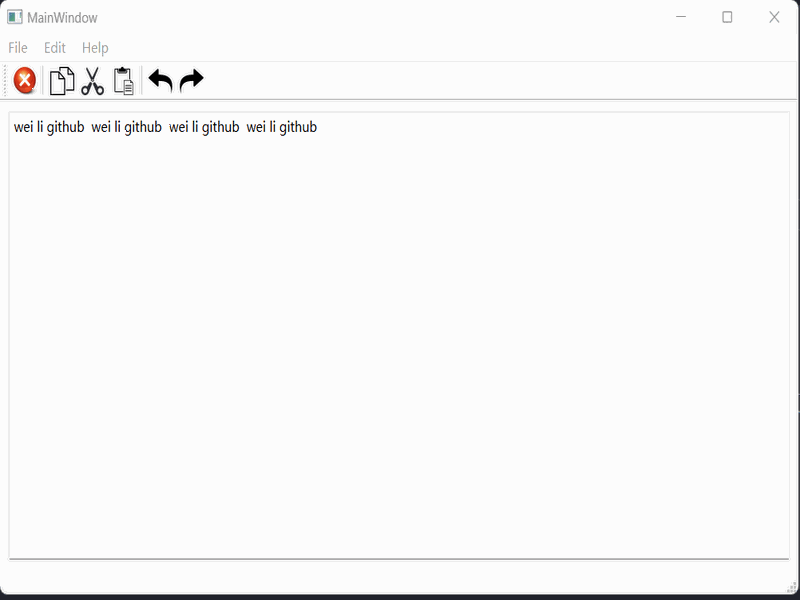

## [Qt for Python: PySide6](https://wiki.qt.io/Qt_for_Python)

> 利用PySide6和Python进行GUI窗口应用程序开发



### **Features**
- [x] Python & VSCode & Miniconda & PySide6 & QtDesigner
- [x] Python & VSCode
- [x] QWidgets & QApplication & QWidget & QPushButton
- [x] Slot and Signal mechanism in QT
- [x] The QtWidgets components: QWidget & QMainWindow & QMessageBox
- [x] The QtWidgets components: QPushButton & QLabel(Image) & QLineEdit & QTextEdit
- [x] QtWidgets QSizePolicy module: Size Policy and Stretch in QT User Interface
- [x] QtWidgets QGridLayout module: the layout for QT User Interface
- [x] QtWidgets QCheckBox and QRadioButton modules
- [x] The QtWidgets components: QListWidget & QTabWidget & QComboBox
- [x] Qt Designer: build layouts by just dragging and dropping
- [x] [Designer(.ui file)](https://doc.qt.io/qtforpython-6/tutorials/basictutorial/uifiles.html) --> PySide6.QtUiTools.QUiLoader --> uic compiler(.py file)
- [x] [Using Resources(.qrc file)](https://doc.qt.io/qtforpython-6/tutorials/basictutorial/qrcfiles.html): Manual or Automatic via Designer
- [x] Qt for Python: Events & Graphics View Framework & Networks & Databases & Threads


### **开发环境搭建**
1. download the [vscode](https://code.visualstudio.com/download) or [pycharm](https://www.jetbrains.com/zh-cn/pycharm/download/?section=windows) as the source code edit
2. download the [python](https://www.python.org/downloads/) or [miniconda](https://docs.anaconda.com/miniconda/miniconda-install/) as the python compiler
3. pip install [pyside6](https://doc.qt.io/qtforpython-6/quickstart.html) as the GUI-framework of application
4. install and configure [vscode extension](https://marketplace.visualstudio.com/items?itemName=zhoufeng.pyqt-integration) for qt
```shell
# install the pyside6 global
pip install pyside6

# configure the qt for pyqt-integration extension
# 1. C:\Users\26940\AppData\Roaming\Python\Python312\site-packages\PySide6\designer.exe
# 2. C:\Users\26940\AppData\Roaming\Python\Python312\Scripts\pyside6-rcc.exe
# 3. C:\Users\26940\AppData\Roaming\Python\Python312\Scripts\pyside6-uic.exe
# 文件工作区，鼠标右键, PYQT: New Form 测试是否可以正常打开 QtDesigner
```


### quick start

```shell
# better advice that installing Miniconda for python 3.11.4

# install PySide6
pip install pyside6

python 00_main_widget.py

# using "uic" compiler to generate .py file or .h file
pyside6-uic 12_widget.ui -o 13_ui_widget.py

# using 'rcc' compiler to generate .py file
pyside6-rcc icons.qrc -o rc_icons.py

```


> [Reference Code](https://github.com/rutura/Qt-For-Python-PySide6-GUI-For-Beginners-The-Fundamentals-)