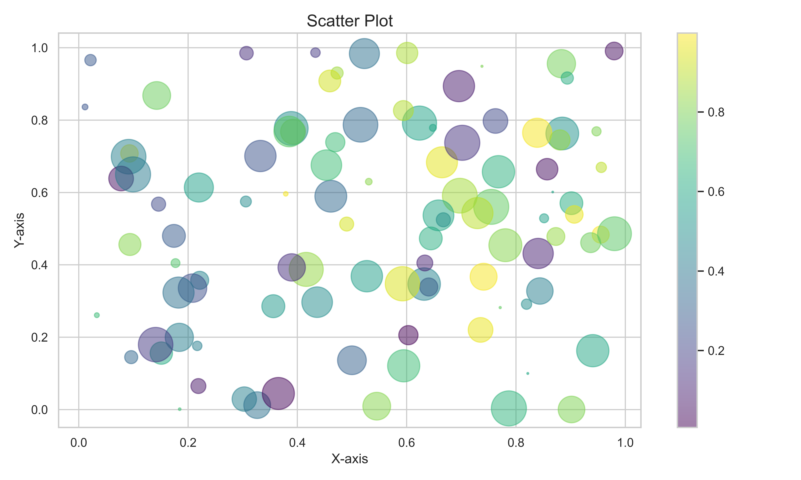
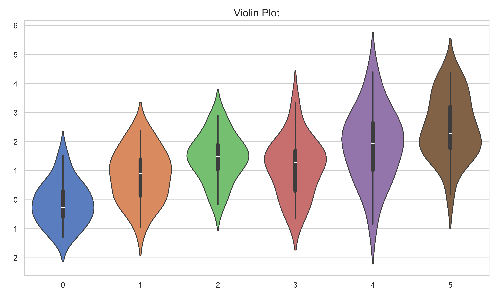

> the Computer Vision with Python; Digital Image Processing with Python; the platform for Pytorch and TensorFlow2; OpenCV with Python and Cpp; the Pillow library; Qt for Python via PySide6. A picture is worth a thousand words for SCI paper.

> [Wei Li Blog](https://2694048168.github.io/blog/)

### **Features**
- [x] Python Logging Module for Application
	- level and log-file
	- 封装 python logging 模块, 根据功能需求存储不同日志文件
	- 自动按照时间或文件大小进行分割日志文件
- [x] SCI paper figures
	- 折线图,散点图,条形图,热力图,箱线图,蜘蛛图,双轴图,面积图,带状图,等高线图,极坐标图
	- 3D曲面图,3D散点图,3D条形图,直方图,小提琴图,成对关系图,Facet Grid 图

<center class="half">


</center>

- [x] Python & MiniConda & Pytorch & TensorFlow & VSCode & Pycharm
- [x] Digital Image Processing with Python and C++ via OpenCV library
- [x] Learning the core and basic of Pytorch for Deep Neural Network
- [x] Learning the core and basic of TensorFlow for Deep Neural Network
- [x] The basic image processing python library: Pillow
- [x] The Dataset and Dataloader for DL in CV via Pytorch
- [x] Image Processing pipeline template with DL tech. via Pytorch
- [x] Qt for Python: PySide6 library

### Quick Start

```shell
# step 1: clone the repo. and into the folder 'ComputerVisionDeepLearning'
git clone --recursive https://github.com/2694048168/ComputerVisionDeepLearning.git
cd ComputerVisionDeepLearning/DatasetDataloader

# 查看每一个文件夹下的 'README.md' 文件说明
# if you want to download specical folder, please using 'gitzip' tool to enter
# the folder path, such as 'https://github.com/2694048168/ComputerVisionDeepLearning/tree/main/DatasetDataloader'

# create 'pytorch' env. with python 3.11.2
conda create --name pytorch python=3.11.2

conda activate pytorch

# pip install all library
pip install -r requirements.txt
# python --version
# python train.py

conda deactivate
```

> [gitzip](http://kinolien.github.io/gitzip/)

### Overview
```
. ComputerVisionDeepLearning
|—— pillow
|   |—— image_gif.py
|   |—— README.md
|—— DatasetDataloader
|   |—— datast
|   |—— data.py
|   |—— dataset.py
|   |—— train.py
|   |—— inference.py
|   |—— model.py
|   |—— requirements.tet
|   |—— README.md
|—— ImageTransformation
|   |—— README.md
|—— PyTorchTemplate
|   |—— README.md
|—— DigitalImageProcessing
|   |—— cpp
|   |—— python
|   |—— image
|   |—— README.md
|—— CS231N
|   |—— images
|   |—— README.md
|—— Learning_Pytorch
|—— Learning_TensorFlow2
|—— Logo.png
|—— gitee_init.png
|—— github_init.png
|—— LICENSE
|—— README.md
```

### **pillow**
<details>
<summary> <span style="color:PeachPuff">PIL(Python Imaging Library)是 Python 的第三方图像处理库, 由于其功能丰富, API 简洁易用; 在 PIL 库的基础上开发了一个支持 Python3 版本的图像处理库, Pillow.</span> </summary>

</details>

### **DatasetDataloader**
<details>
<summary> <span style="color:PeachPuff">How to organization and loading data from disk via PyTorch by our custom way, Creating 'Dataset' feed into Model, e.g. the dataset pipeline and tricks. The Image Super-Resolution example, Image Transformation Processing, could be to promote the Low-Light Image Enhancementation, Image Deraining, Image Defogging, for creating Dataset and the whole pipeline.</span> </summary>

**Dataset and Dataloader of PyTorch**

> How to **organization** and **loading** data from disk via PyTorch by our custom way, Creating 'Dataset' feed into Model, e.g. the dataset pipeline and tricks. The Image Super-Resolution example, **Image Transformation Processing**, could be to promote the Low-Light Image Enhancementation, Image Deraining, Image Defogging, for creating Dataset and the whole pipeline.

> [关于Python环境的详细配置过程以及技巧](https://2694048168.github.io/blog/#/PaperMD/python_env_ai)

**Quick Start**
```shell
# create 'pytorch' env. with python 3.11.2
conda create --name pytorch python=3.11.2

conda activate pytorch

# pip install all library
pip install -r requirements.txt
# python --version
# python train.py

conda deactivate
```

**useful link**
- [Datasets & Dataloaders Tutorials](https://pytorch.org/tutorials/beginner/basics/data_tutorial.html)
- [Dataset Class Source](https://github.com/pytorch/pytorch/blob/master/torch/utils/data/dataset.py)
- [Dataloader Class Source](https://github.com/pytorch/pytorch/blob/master/torch/utils/data/dataloader.py)
- Effective Python V2 book and Note

**Example**
```
. Dataset_Dataloader
|—— data.py
|—— dataset.py
|—— model.py
|—— train.py
|—— inference.py
|—— dataset
|   |—— super_resolution
|   |—— |—— train
|   |—— |—— test
|   |—— classification
|   |—— |—— train
|   |—— |—— test
|—— checkpoints
|   |—— SRCNN_epoch_{epoch}.pth
|—— results
|   |—— SR_butterfly_LRBI_x4.png
|—— requirements.txt
|—— README.md
```

</details>

**DigitalImageProcessing**
<details>
<summary> <span style="color:PeachPuff">通过 OpenCV 库针对数字图像处理算法进行精解, 提供 Python 和 C++ 源代码</span> </summary>

</details>

**ImageTransformation**
<details>
<summary> <span style="color:PeachPuff">Image transformation processing using Deep Learning technology with PyTorch platform, including the image super-resolution (SR), image deraining, image defogging or image dehaze, low-illumination image enhancement, infrared and visible image fusion, multi-exposure image fusion, remote sensing image fusion(Pansharpening). Image transformation processing tasks, which the input of network is a image and the output of network is also a image. The framework can be well extended to high-level computer vision processing tasks such as image classification, object detection, instance segmentation.</span> </summary>

> [关于Python环境的详细配置过程以及技巧](https://2694048168.github.io/blog/#/PaperMD/python_env_ai)

> Welcome everybody to fork, star and watch this repository and project.

**Quick Start**
```shell
# create 'pytorch' env. with python 3.11.2
conda create --name pytorch python=3.11.2

conda activate pytorch

# pip install all library
pip install -r requirements.txt
```

Image transformation processing using Deep Learning technology with PyTorch platform, including the **image super-resolution** (SR), image deraining, image defogging or image dehaze, low-illumination image enhancement, infrared and visible image fusion, multi-exposure image fusion, remote sensing image fusion(Pansharpening). Image transformation processing tasks, which the input of network is a image and the output of network is also a image. The framework can be well extended to high-level computer vision processing tasks such as image classification, object detection, instance segmentation.

</details>

----------------------

**乍一看到某个问题，你会觉得很简单，其实你并没有理解其复杂性。当你把问题搞清楚之后，又会发现真的很复杂，于是你就拿出一套复杂的方案来。实际上，你的工作只做了一半，大多数人也都会到此为让......。但是，真正伟大的人还会继续向前，直至找到问题的关键和深层次原因，然后再拿出一个优雅的、堪称完美的有效方案。**

&emsp;&emsp;&emsp;&emsp;&emsp;&emsp;&emsp;&emsp;&emsp;&emsp;&emsp;&emsp;&emsp;&emsp;&emsp;&emsp;&emsp;&emsp;—— 乔布斯

**“When you start looking at a problem and it seems really simple, you don't really understand the complexity of the problem. Then you get into the problem, and you see that it's really complicated, and you come up with all these convoluted solutions. That's sort of the middle, and that's where most people stop.... But the really great person will keep on going and find the key, the underlying principle of the problem—and come up with an elegant, really beautiful solution that works.”**

	— Steve Jobs (quoted in Insanely Great: The Life and Times of Macintosh, the Computer that Changed Everything by Steven Levy)
