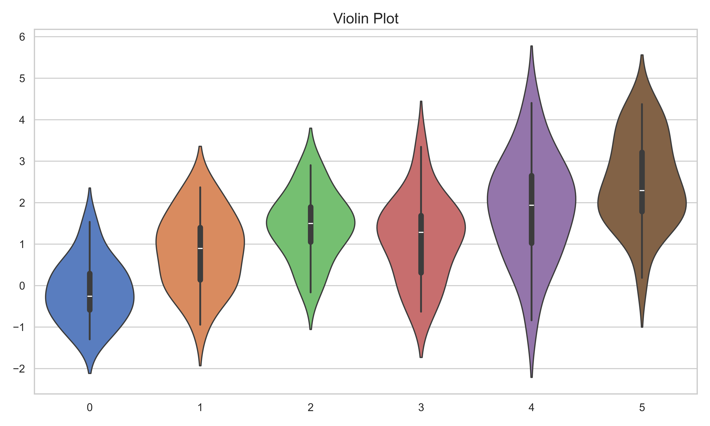

## SCI Paper Figures

> A picture is worth a thousand words in paper.

### Figure Gallery

**折线图 line_figure.py**

**散点图 scatter_figure.py**

**条形图 bar_figure.py**

**热力图 heatmap_figure.py**

**箱线图 box_figure.py**

**蜘蛛图 spider_figure.py**

**双轴图 twin_figure.py**

**面积图 area_figure.py**

**带状图 band_figure.py**

**等高线图 contour_figure.py**

**极坐标图 polar_figure.py**

**3D曲面图 3DSurface_figure.py**

**3D散点图 3DScatter_figure.py**

**3D条形图 3DBar_figure.py**

**直方图 histogram_figure.py**

**小提琴图 violin_figure.py**

**成对关系图 pair_figure.py**

**Facet Grid 图 Facet_grid_figure.py**

